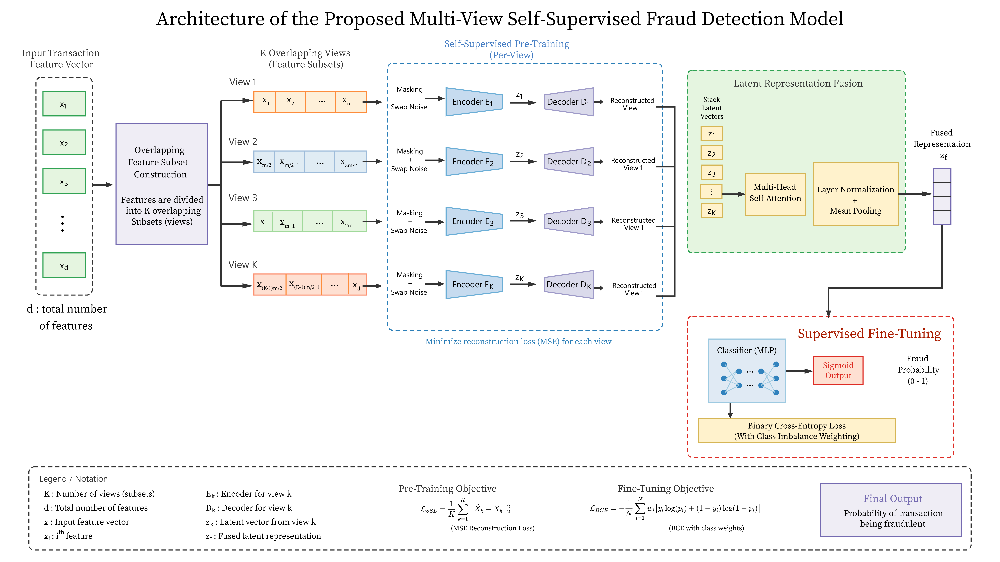
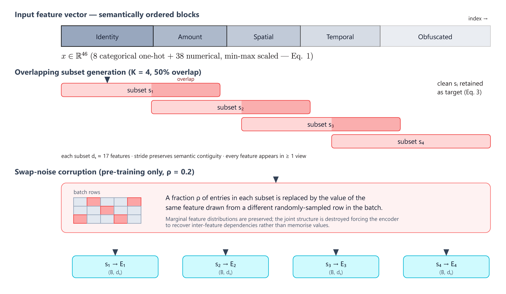
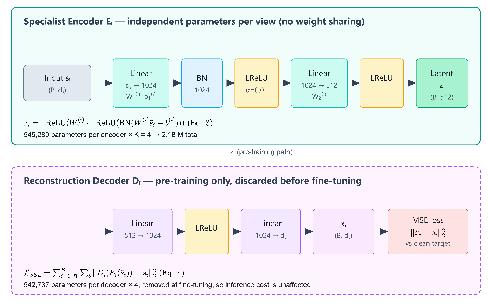
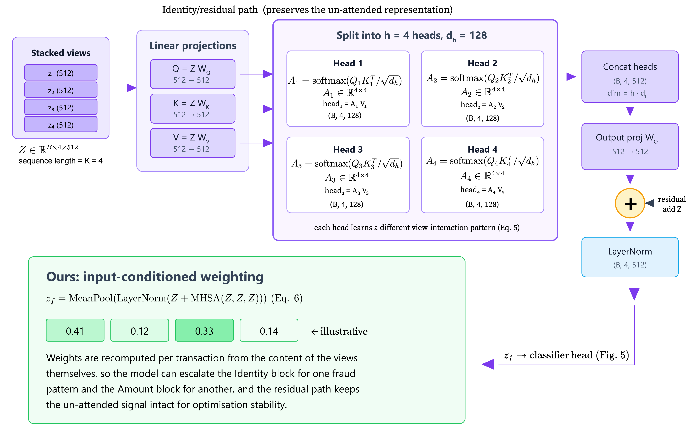
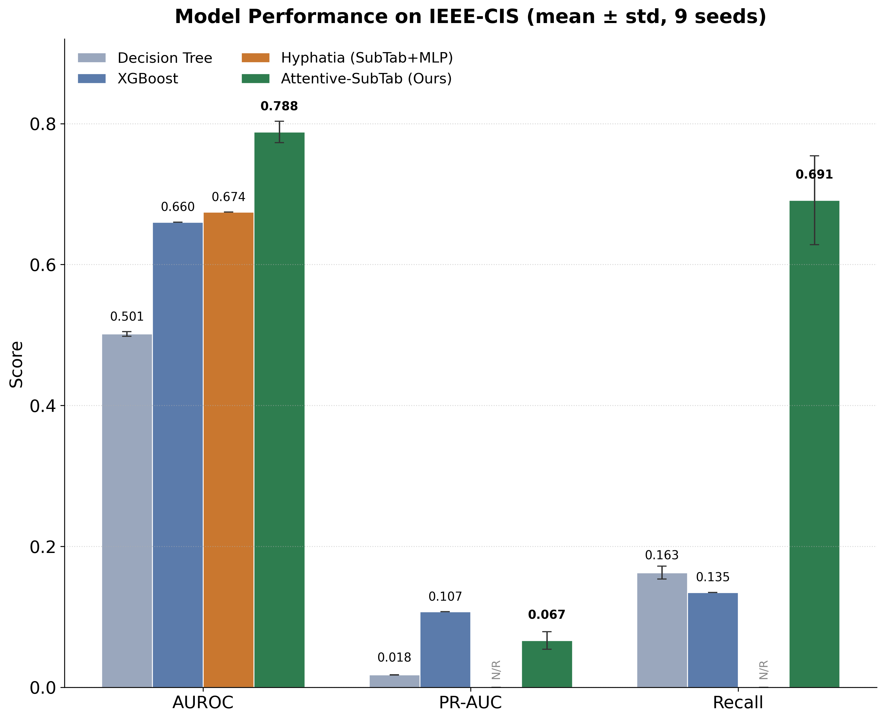
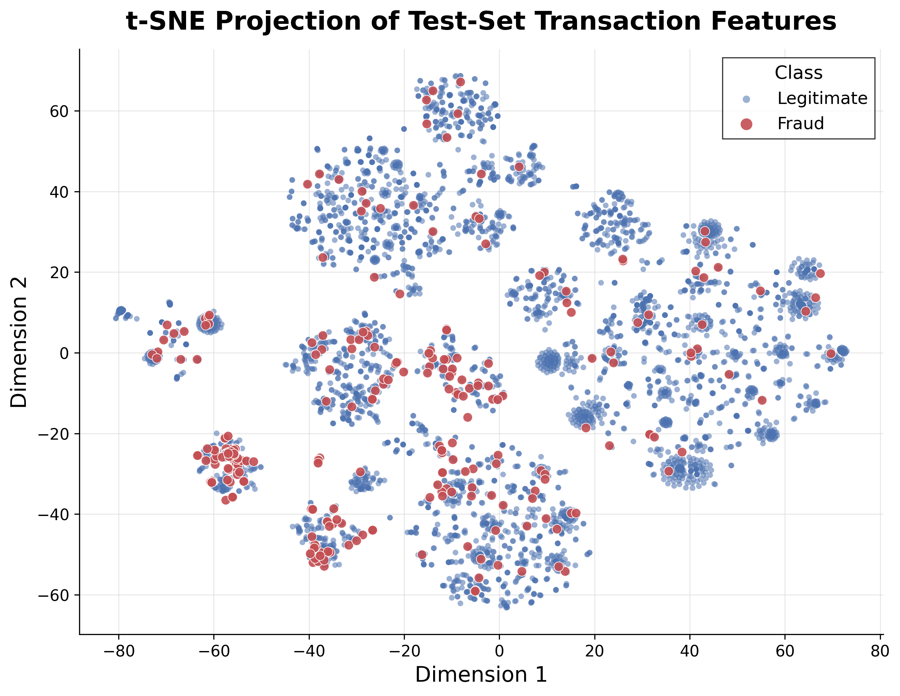
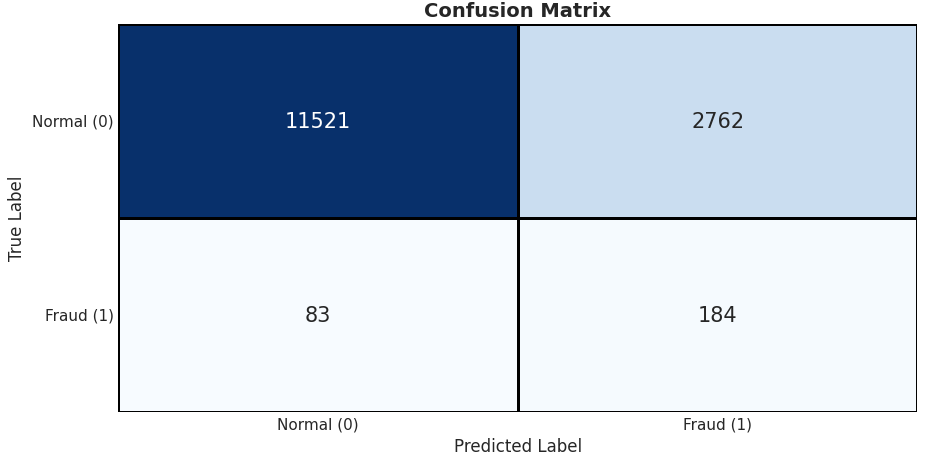
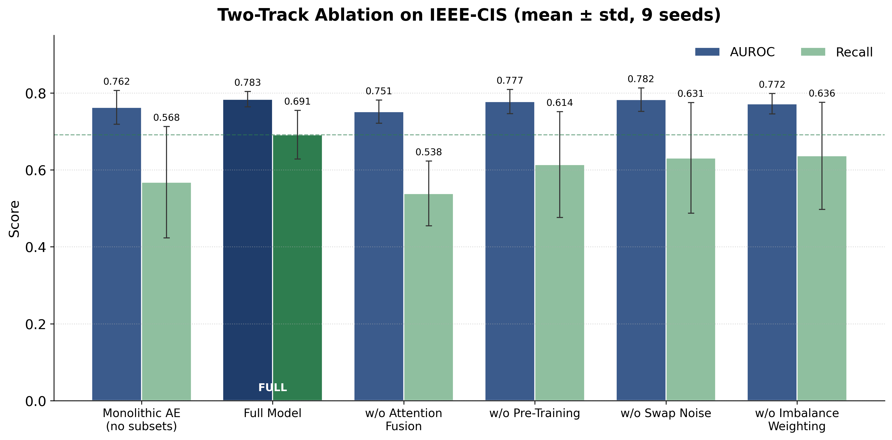

# Attentive-SubTab: Self-Supervised Subset Encoding for Transactional Fraud Detection

Official repository for the paper:

**Attentive-SubTab: Self-Supervised Subset Encoding for Transactional Fraud Detection**
**Zohayer Mehtab**, **Saad Jarif**, **Samiur Rahman**, **Md. Iftekharul Mobin***
Department of Computer Science, American International University-Bangladesh, Dhaka, Bangladesh

## 📋 Abstract

Fraud detection on transactional tabular data is hampered by extreme class imbalance and the high cost of labeled data. While self-supervised learning (SSL) alleviates label scarcity, existing subset-based SSL approaches rely on shared encoders and simple mean-pooling, assigning every feature subset equal weight regardless of the actual informativeness. We present Attentive-SubTab, an architecture that partitions transaction features into subsets, assigns independent, subset-specific encoders to each one, and fuses their representations using multi-head self-attention. To handle the extreme minority class, the model is evaluated at an F1-optimal decision threshold. On the IEEE-CIS dataset, Attentive-SubTab reaches a mean AUROC of 0.7835 and recall of 0.6912, substantially improving upon a tuned XGBoost baseline (0.6602 AUROC, 0.1348 recall), though XGBoost retains a higher PR-AUC (0.1073 vs. 0.0665). On the independent ULB dataset, the model again has a higher AUROC than XGBoost but a lower PR-AUC and recall. Ablations show that dedicated encoders alone, without attention fusion, are statistically indistinguishable from a monolithic baseline. We conclude that Attentive-SubTab is best characterized as a recall-oriented fraud detector suited to high-volume triage, although its deployment value still has to be established through cost-sensitive evaluation.

---

## 📑 Table of Contents

- [Overview](#-overview)
- [Key Contributions](#-key-contributions)
- [Dataset](#-dataset)
- [Model Architecture](#-model-architecture)
- [Installation](#-installation)
- [Hyperparameters](#hyperparameters)
- [Results](#-results)
- [Ablation Study](#-ablation-study)
- [Independent-Dataset Evaluation on ULB](#-independent-dataset-evaluation-on-ulb)
- [Summary of Hypothesis Outcomes](#-summary-of-hypothesis-outcomes)
- [Limitations and Future Work](#-limitations-and-future-work)
- [Citation](#-citation)
- [License](#-license)

---

## 🔍 Overview

This repository contains the reference implementation for:

- Overlapping feature-subset partitioning (K = 4, 50% overlap) of the transaction feature vector
- Independent, subset-specific encoder-decoder pairs, self-supervised via swap-noise reconstruction
- Multi-head self-attention (MHSA) fusion of the four subset representations, in place of unweighted mean-pooling
- Class-ratio weighted fine-tuning with F1-optimal decision-threshold calibration
- A strict chronological (time-aware) train/test evaluation protocol on IEEE-CIS
- An independent-dataset evaluation of the same architecture, unmodified, on the PCA-anonymized ULB dataset
- A two-track ablation study (architectural foundation vs. Attentive-SubTab mechanics) across 9 random seeds

---

## 🎯 Key Contributions

1. **Dedicated encoders + attention fusion**: a modification of the SubTab framework that assigns a dedicated, subset-specific encoder to each feature subset and fuses the resulting representations with multi-head self-attention followed by mean aggregation, in place of a shared encoder and unweighted mean-pooling.
2. **Imbalance-aware fine-tuning recipe**: a class-ratio weighted binary cross-entropy loss combined with F1-optimal threshold calibration, with a seed-replicated statistical assessment (Welch's *t*-test, 9 seeds) of each component's isolated effect.
3. **Leakage-aware chronological protocol**: a strict, time-aware chronological evaluation split intended to avoid temporal leakage, together with an explicit discussion of what chronological splitting does and does not guarantee for entity-level aggregate features.
4. **Independent-dataset evaluation**: the same architecture, with no dataset-specific tuning, evaluated on the PCA-anonymized ULB credit-card dataset, with a metric-by-metric comparison against XGBoost.

---

## 📊 Dataset

### Dataset Statistics

| Attribute | IEEE-CIS | ULB |
|---|---|---|
| Transactions | 1M+ (58,200 train entities / 14,550 test entities) | 284,807 |
| Fraud rate (test) | 1.84% (267 / 14,550) | 0.172% |
| Feature representation | 46 engineered (8 categorical, 38 numerical) → 68-dim after one-hot | 30-dim anonymized PCA components (Time, Amount, 28 PCA) |
| Split | Chronological 80% / 20% | Chronological 80% / 20% (sorted by Time) |
| Tuning | Primary dataset — architecture developed here | No dataset-specific tuning; same hyperparameters as IEEE-CIS |

### Feature Engineering (IEEE-CIS)

The feature-engineering pipeline follows the Hyphatia framework: transactions are grouped into entities defined by combinations of payment-card information, device identifiers, and email domains, and aggregate statistics (min, max, mean) are computed per entity for continuous variables, along with the average number of days between an entity's consecutive transactions. Missing numerical values are imputed with −1 (the temporal-gap feature with 0); missing categoricals get a separate unknown category. All scaling statistics are fit on the training partition only, followed by standardization then min-max normalization.

> **Leakage note**: the chronological split guarantees no test transaction precedes any training transaction. Whether every per-entity aggregate feature itself uses only strictly-prior information depends on the inherited Hyphatia aggregation implementation — this is called out explicitly as a limitation, not assumed away.

---

## 🏗 Model Architecture

### Figure 1: Overall Framework



**Figure 1.** Overlapping feature subsets are each encoded by a dedicated, subset-specific encoder; the resulting latent representations are fused with multi-head self-attention followed by mean aggregation; the fused representation is fine-tuned for fraud classification.


### 1. Feature-Space Partitioning

The 68-dimensional feature space is divided into K = 4 overlapping subsets of expected dimensionality d_s ≈ 17, with 50% overlap between consecutive subsets to preserve cross-feature relationships. K and the overlap fraction are held fixed across all experiments.



**Figure 2.** The 46-feature input vector is arranged so that contiguous index ranges correspond to semantically related groups (identity/device, amount, spatial, temporal, obfuscated). K = 4 overlapping subsets are generated with a stride that preserves semantic contiguity, so every feature appears in at least one view. During pretraining, swap-noise (ρ = 0.2) replaces a fraction of entries in each subset with the same feature drawn from a different row in the batch — preserving marginal feature distributions while destroying joint structure, forcing each encoder to recover inter-feature dependencies rather than memorize values.

### 2. Subset-Specific Encoding + Self-Supervised Pretraining

Each subset is processed by an independent encoder with no weight sharing across subsets:

$$z_i = \text{LReLU}\big(W_2^{(i)} \cdot \text{LReLU}(\text{BN}(W_1^{(i)} s_i + b_1^{(i)})) + b_2^{(i)}\big)$$

Swap-noise-corrupted subsets are reconstructed by a matching decoder during a 5-epoch pretraining phase, minimizing MSE against the clean target. Decoders are discarded before fine-tuning, so they add no inference cost.



**Figure 3.** Each of the four subset-specific encoders (d_s → 1024 → 512, ≈545K parameters each, ≈2.18M total) has independent weights — no sharing across subsets. Each is paired with a reconstruction decoder (512 → 1024 → d_s, ≈543K parameters each) used only during the 5-epoch SSL pretraining phase and discarded before fine-tuning, so the ≈2.18M decoder parameters never affect inference cost.

### 3. Multi-Head Self-Attention Fusion

The four subset representations are stacked into Z = [z₁, ..., z₄] and passed through multi-head self-attention (4 heads) with a residual connection and layer normalization, then mean-pooled across the K = 4 positions:

$$\hat{Z} = \text{LayerNorm}(Z + \text{MHSA}(Z, Z, Z)), \qquad z_f = \frac{1}{K}\sum_{i=1}^{K}\hat{Z}_i$$

This is the single architectural change the ablation study isolates most cleanly (Section 5.3 below): it is the only component in the two-track ablation with a statistically significant effect on all three headline metrics.



**Figure 4.** The four 512-dim subset representations are projected to Q/K/V, split across 4 heads (d_h = 128), and each head learns a distinct view-interaction pattern before the heads are concatenated, output-projected, added back via a residual connection, and layer-normalized. Because attention weights are recomputed per transaction from the content of the views themselves, the model can, in principle, up-weight different subsets for different transactions — the identity/device block for one fraud pattern, the amount block for another — rather than always averaging all four equally as mean-pooling does.

### 4. Classifier Head + Imbalance-Aware Fine-Tuning

The fused representation z_f is passed to an MLP classifier (512 → 256 → 1, ReLU, dropout 0.5, sigmoid output), trained with a class-ratio weighted binary cross-entropy loss:

$$\mathcal{L}_{\text{BCE}} = -\frac{1}{N}\sum_{i=1}^{N} w_i\big[y_i\log(p_i) + (1-y_i)\log(1-p_i)\big], \qquad w_i = r \text{ for fraud}, \; 1 \text{ otherwise}$$

Rather than the default 0.5 threshold, the decision threshold that maximizes F1 on the validation precision-recall curve is selected — a reasonable default operating point, not necessarily the operationally correct one for a given cost structure.

---

## 🛠 Installation

### Requirements

- Python 3.8+
- PyTorch
- NumPy
- scikit-learn

### Setup

```bash
# Clone the repository
git clone https://github.com/<your-username>/attentive-subtab-fraud-detection.git
cd attentive-subtab-fraud-detection

# Create virtual environment
python -m venv venv
source venv/bin/activate  # On Windows: venv\Scripts\activate

# Install dependencies
pip install -r requirements.txt
```

### Running

`attentive_subtab.py` expects a preprocessed, chronologically split dataset cached as an `.npz` file (with `X_train`, `X_test`, `y_train`, `y_test` arrays) at `./cache/hyphatia_paper_features_time_sorted_v2.npz`. Point `DATA_CACHE_PATH` at your own cache if it lives elsewhere, then:

```bash
python attentive_subtab.py
```

This runs the full pretrain → fine-tune → evaluate pipeline across all 9 seeds (42–50) and writes:
- `results/9_seed_summary.txt` — mean ± std across seeds for train and test metrics
- `results/model_evaluation_results.npz` — best-seed predictions and probabilities, for downstream plotting

### Hyperparameters

All experiments (IEEE-CIS and ULB, no dataset-specific tuning) use:

| Parameter | Value | Parameter | Value |
|---|---|---|---|
| Subsets (K) | 4 | Fine-tuning epochs | 50 |
| Subset overlap | 50% | Batch size | 1024 |
| Masking ratio (ρ) | 0.2 | Learning rate | 10⁻³ |
| Hidden dimension | 1024 | Weight decay | 10⁻⁴ |
| Latent dimension | 512 | Scheduler factor | 0.5 |
| Attention heads | 4 | Scheduler patience | 3 epochs |
| Classifier dim | 256 | Min. learning rate | 10⁻⁶ |
| Dropout | 0.5 | Validation split | Last 20% |
| Pretrain epochs | 5 | Random seeds | 42–50 |

---

## 📈 Results

### Main Benchmark on IEEE-CIS

Attentive-SubTab substantially raises recall and AUROC relative to XGBoost, at the cost of PR-AUC — neither model dominates the other.

**Table 1.** Performance on IEEE-CIS across 9 random seeds (mean ± SD).

| Model | AUROC | PR-AUC | Recall |
|---|---|---|---|
| Decision Tree | 0.5015 ± 0.0032 | 0.0177 ± 0.0001 | 0.1627 ± 0.0092 |
| XGBoost | 0.6602 ± 0.0000 | **0.1073 ± 0.0000** | 0.1348 ± 0.0000 |
| Hyphatia (SubTab + MLP) | 0.6744 | – | – |
| **Attentive-SubTab (Ours)** | **0.7835 ± 0.0201** | 0.0665 ± 0.0125 | **0.6912 ± 0.0630** |



**Figure 5.** AUROC, PR-AUC, and recall of each model on the IEEE-CIS dataset.

### Latent Space Visualization



**Figure 6.** t-SNE projection of the fused representation z_f for the IEEE-CIS test set, colored by class. Fraud (red) is not confined to a single region: most clusters are a mix of legitimate and fraudulent points, but several clusters — most visibly the dense red cluster near (−60, −25) — are almost entirely fraud, and a number of smaller clusters show fraud points concentrated at their edges or in tight sub-groups rather than scattered uniformly. This is consistent with the model's recall-oriented behavior: the representation separates a meaningful share of fraud into locally coherent regions, without producing clean global separation between the two classes — which is itself consistent with the modest PR-AUC reported in Table 1.

### Decision-Threshold Analysis

At the F1-optimal threshold for a representative seed: 184 true positives, 83 false negatives, 2,762 false positives, 11,521 true negatives (14,550 total). This gives an alert rate of 20.25%, precision of 6.25%, recall of 68.9%, and specificity of 80.7% — a plausible starting point for a manual-review triage system, though full operational readiness requires deployment-specific parameters (investigator capacity, cost per review, loss avoided per detected fraud case) not established in this study.



**Figure 7.** Confusion matrix for a single representative seed at its F1-optimal decision threshold.

---

## 🔬 Ablation Study

**Table 2.** Two-track ablation across 9 seeds on IEEE-CIS (mean ± SD).

| Variant | AUROC | PR-AUC | Recall |
|---|---|---|---|
| *Track 1: Architectural foundation* | | | |
| Monolithic autoencoder (single shared encoder) | 0.7622 ± 0.0438 | **0.1397 ± 0.0494** | 0.5676 ± 0.1447 |
| *Track 2: Attentive-SubTab mechanics* | | | |
| **Full model** (dedicated encoders + attention) | **0.7835 ± 0.0201** | 0.0665 ± 0.0125 | **0.6912 ± 0.0630** |
| w/o attention fusion (dedicated encoders + mean pooling) | 0.7514 ± 0.0300 | 0.1539 ± 0.0293 | 0.5385 ± 0.0842 |
| w/o pretraining | 0.7774 ± 0.0314 | 0.1037 ± 0.0500 | 0.6138 ± 0.1374 |
| w/o swap noise | 0.7825 ± 0.0305 | 0.0622 ± 0.0104 | 0.6309 ± 0.1437 |
| w/o imbalance weighting | 0.7718 ± 0.0263 | 0.0667 ± 0.0207 | 0.6363 ± 0.1390 |



**Figure 8.** Ablation results across architectural and training-recipe variants.

**Key finding (H3, attention fusion — supported)**: comparing the full model against the no-attention variant isolates attention's effect: it raises recall from 0.5385 → 0.6912 (t ≈ 4.36, p < .001) and AUROC from 0.7514 → 0.7835 (t ≈ 2.67, p ≈ .02), but lowers PR-AUC from 0.1539 → 0.0665 (t ≈ −8.23, p < .001). This is the clearest evidence in the study for an architectural effect, and it is a trade-off, not a free lunch.

**Key finding (H1, subsetting + dedicated encoding — not supported in isolation)**: the monolithic single-encoder baseline and the no-attention (dedicated encoders + mean-pooling) variant are statistically indistinguishable on all three metrics, despite the four dedicated encoders together holding roughly 4× the parameters of the monolithic encoder. Dedicated encoding alone does not measurably help; the benefit only appears once attention fusion is added on top.

---

## 🌍 Independent-Dataset Evaluation on ULB

The same architecture, trained and evaluated entirely within ULB with no dataset-specific tuning and no transfer from IEEE-CIS, across the same 9 seeds.

**Table 3.** Independent-dataset evaluation on ULB (mean ± SD).

| Model | AUROC | PR-AUC | Recall |
|---|---|---|---|
| Decision Tree | 0.8595 ± 0.0000 | 0.4792 ± 0.0120 | 0.0000 ± 0.0000 |
| XGBoost | 0.9691 ± 0.0065 | **0.7820 ± 0.0092** | **0.7393 ± 0.0190** |
| Monolithic autoencoder | 0.9824 ± 0.0046 | 0.7521 ± 0.0587 | 0.5289 ± 0.2837 |
| **Attentive-SubTab** | **0.9856 ± 0.0020** | 0.7219 ± 0.0485 | 0.7037 ± 0.0469 |

Attentive-SubTab reaches a significantly higher AUROC than XGBoost (t ≈ 7.28, p < .001), but significantly lower PR-AUC (t ≈ −3.65, p < .01) and somewhat lower recall (t ≈ −2.11, p ≈ .05) — the same "AUROC up, PR-AUC and recall trade off differently" pattern as on IEEE-CIS, on a dataset with a completely different feature representation (anonymized PCA components vs. engineered, semantically grouped features).

---

## 📋 Summary of Hypothesis Outcomes

**Table 4.** Outcomes for the five hypotheses stated in the methodology, based on the ablation evidence above.

| Hyp. | Statement | Outcome |
|---|---|---|
| H1 | Subsetting + dedicated encoders improve on a monolithic encoder | Not supported in isolation (n.s. on all three metrics) |
| H2 | Dedicated encoders outperform a shared encoder, subsets held fixed | Not directly tested (missing ablation cell — see Limitations) |
| H3 | Attention fusion improves on mean-pooling | Supported for recall and AUROC (p < .05); PR-AUC decreases significantly (p < .001) — a trade-off |
| H4 | Class-ratio weighting improves recall | Directionally consistent, not statistically significant at n = 9 |
| H5 | F1-optimal thresholding improves the chosen operating point | True by construction (post-hoc calibration); not an ablatable empirical claim |

---

## ⚠️ Limitations and Future Work

- **H2 untested**: a full 2×2 factorial ablation ({shared, dedicated} encoders × {mean-pooling, attention} fusion) is needed to separate the contribution of encoder structure from fusion mechanism.
- **Attention weights unanalyzed**: average attention mass per subset, its variation between fraud/legitimate transactions, and its stability across seeds have not been examined.
- **Partition sensitivity untested**: K ∈ {2, 4, 6} and overlap ∈ {0%, 25%, 50%} were held fixed and not swept; semantic vs. random vs. non-overlapping partitions were not compared.
- **Leakage control is chronological splitting only**: a time-indexed re-implementation of the entity-level aggregate features, verifying every aggregate uses strictly-prior information, is left to future work.
- **No true cross-dataset transfer**: IEEE-CIS-trained → ULB-evaluated (or vice versa) has not been tested; the ULB result is an independent-dataset evaluation, not a transfer experiment.
- **Baseline suite incomplete**: a plain MLP, TabNet, and an FT-Transformer-style model are discussed but not trained as comparators.
- **No deployment-readiness evaluation**: wall-clock training time, inference latency, and a cost-sensitive analysis (precision at fixed alert rate, recall at fixed false-positive rate, utility under an explicit cost matrix) are all needed before any operational claim.
- **Unpaired significance testing**: per-seed metrics were not retained, so the Welch's t-tests above are approximate and unpaired; a seed-matched paired test would have more power and should replace this in future work.

---

## 📜 Citation

```bibtex
@article{mehtab2026attentive,
  title={Attentive-SubTab: Self-Supervised Subset Encoding for Transactional Fraud Detection},
  author={Mehtab, Zohayer and Jarif, Saad and Rahman, Samiur and Mobin, Md. Iftekharul},
  year={2026},
  affiliation={American International University-Bangladesh}
}
```

---

## 📄 License

This project is licensed under the MIT License - see the LICENSE file for details.

---

## 🤝 Contact

For questions or collaborations, please contact:

- **Md. Iftekharul Mobin**: iftekhar.mobin@aiub.edu

